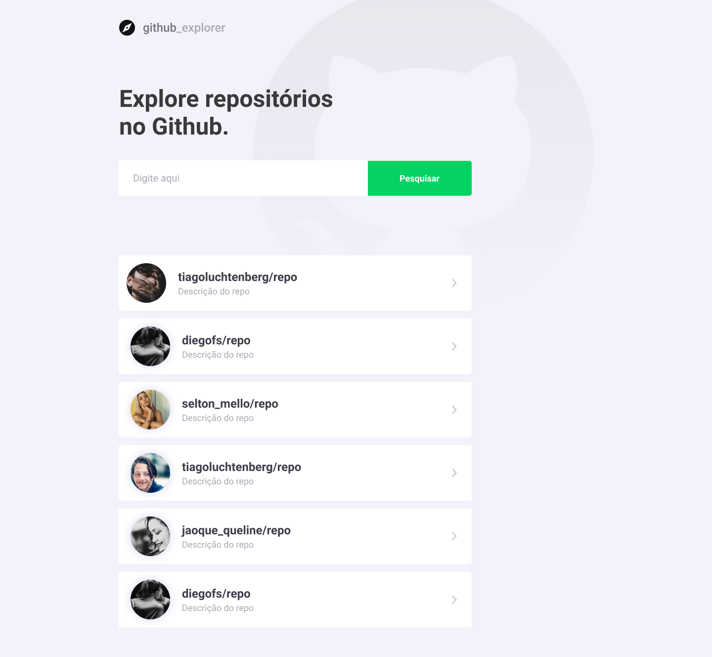

<h1 align="center">
  
</h1>

<h3 align="center">
  Explorador de repositórios utilizando Github API
</h3>


<p align="center">
  <a href="#-about-the-project">About the project</a>&nbsp;&nbsp;&nbsp;|&nbsp;&nbsp;&nbsp;
  <a href="#-technologies">Technologies</a>&nbsp;&nbsp;&nbsp;|&nbsp;&nbsp;&nbsp;
  <a href="#-getting-started">Getting started</a>
</p>

## 💡 About

This aplication was developed to study concepts of ReactJS. It allows searching and registering repositories with some informations.

An online version of the project can be accessed [here](https://thyusofficial.github.io/github-explorer/) 🖥️

<details><summary><strong> Project Layout </strong></summary>
  
  
  
</details>

## 🚀 Technologies

Technologies that I used to develop this web application

- [ReactJS](https://reactjs.org/)
- [TypeScript](https://www.typescriptlang.org/)
- [React Router DOM](https://reacttraining.com/react-router/)
- [React Icons](https://react-icons.netlify.com/#/)
- [Styled Components](https://styled-components.com/)
- [Axios](https://github.com/axios/axios)
- [Eslint](https://eslint.org/)
- [Prettier](https://prettier.io/)
- [EditorConfig](https://editorconfig.org/)

## 💻 Getting started

### Requirements

- [Node.js](https://nodejs.org/en/)
- [Yarn](https://yarnpkg.com/)

**Clone the project and access the folder**

```bash
$ git clone https://github.com/thyusofficial/github-explorer.git && cd github-explorer
```

**Then**

```bash
# Install the dependencies
$ yarn

# Start the client
$ yarn start
```

---

Made with by Matheus Cardoso 💻 [See my linkedin](https://www.linkedin.com/in/thyus/)
